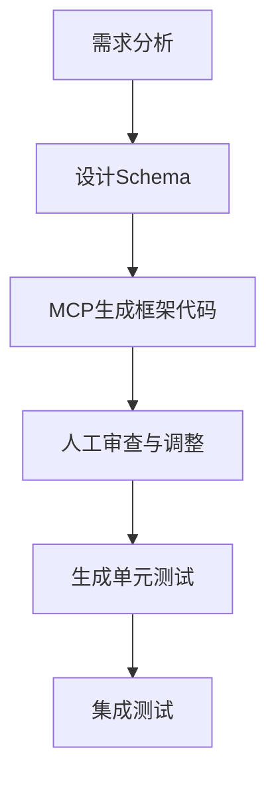

# MCP驱动的规则怪谈游戏开发计划

## 项目评估总览

### 可行性评分
- **技术可行性**: ★★★★☆ (4/5)
- **游戏设计可行性**: ★★★★★ (5/5)  
- **商业可行性**: ★★★☆☆ (3/5)
- **开发难度**: ★★★☆☆ (中等)
- **创新性**: ★★★★★ (5/5)

### 核心优势
1. **双模式玩法**创新：管理者视角 + 亲自下场
2. **规则创造系统**深度足够，可玩性高
3. **技术方案成熟**，风险可控
4. **数据结构设计专业**，扩展性好

### 主要挑战
1. LLM调用成本与延迟控制
2. 规则组合爆炸的平衡性
3. 文本生成与数值系统的一致性
4. 内容量需求大

---

## MCP开发流程设计

### Phase 0: 项目初始化与架构搭建 (第1周)

#### 0.1 项目结构生成
```
RuleK/
├── src/
│   ├── core/           # 核心游戏逻辑
│   ├── managers/       # 各系统管理器
│   ├── models/         # 数据模型
│   ├── api/           # API接口
│   └── utils/         # 工具函数
├── data/
│   ├── schemas/       # JSON Schema定义
│   ├── templates/     # 规则/事件模板
│   └── saves/         # 存档文件
├── web/
│   ├── static/        # 静态资源
│   └── templates/     # HTML模板
├── tests/             # 测试用例
└── docs/              # 文档
```

#### 0.2 核心类生成任务
- [ ] GameManager - 游戏主控制器
- [ ] RuleManager - 规则系统管理
- [ ] NPCManager - NPC行为与状态
- [ ] SpiritManager - 诡异单位管理
- [ ] MapManager - 地图与区域系统
- [ ] ResourceSystem - 积分与资源管理

#### 0.3 数据模型定义
- [ ] Rule Schema验证器
- [ ] NPC属性模型
- [ ] Spirit数据结构
- [ ] Area地图模型
- [ ] GameState存档格式

### Phase 1: 核心系统实现 (第2-3周)

#### 1.1 规则引擎
```python
# MCP生成任务：
1. 创建规则DSL解析器
2. 实现规则触发条件判定
3. 建立规则效果执行器
4. 开发破绽系统
5. 实现规则升级机制
```

#### 1.2 NPC行为系统
```python
# MCP生成任务：
1. 行为树基础框架
2. 性格->行为权重映射
3. 关系网络系统
4. 记忆与学习机制
5. 对话状态机
```

#### 1.3 回合/日程控制器
```python
# MCP生成任务：
1. 时间片调度器
2. 事件队列管理
3. 阶段转换状态机
4. 动作解析器
5. 结算流程控制
```

### Phase 2: AI集成与叙事系统 (第4周)

#### 2.1 DeepSeek接口封装
```python
# MCP实现重点：
1. API调用管理器（限流/重试/缓存）
2. Prompt模板系统
3. 响应解析与验证
4. 成本监控器
```

#### 2.2 叙事生成器
```python
# 生成任务：
1. 事件->文本转换器
2. 对话上下文管理
3. 小说化段落生成
4. 多风格叙事模板
```

### Phase 3: WebUI与交互层 (第5周)

#### 3.1 前端框架搭建
- 游戏主界面布局
- 规则编辑器UI
- NPC状态面板
- 地图可视化
- 日志与叙事显示

#### 3.2 实时交互系统
- WebSocket事件推送
- 玩家动作处理
- 状态同步机制

### Phase 4: 内容与平衡 (第6周)

#### 4.1 初始内容包
```yaml
规则模板: 10个
地图事件: 20个
NPC原型: 8个
诡异类型: 5个
道具系统: 15个
```

#### 4.2 平衡性调整
- 成本公式优化
- 概率曲线调整
- 难度梯度设计

---

## MCP执行策略

### 1. 代码生成流程


### 2. 迭代开发模式
- **每日目标**：完成2-3个核心模块
- **测试驱动**：先生成测试用例，再实现功能
- **增量集成**：每个模块独立可测试

### 3. 质量保证措施
- 自动化测试覆盖率 > 80%
- 代码审查检查点
- 性能基准测试
- 内存泄漏检测

---

## 技术决策建议

### 1. 核心技术栈（推荐）
```yaml
后端:
  - Python 3.10+
  - FastAPI (异步性能好)
  - Pydantic (数据验证)
  - SQLAlchemy (ORM)
  - Redis (缓存层)

前端:
  - React + TypeScript
  - Tailwind CSS
  - Socket.io
  - Zustand (状态管理)

AI集成:
  - httpx (异步HTTP)
  - tenacity (重试机制)
  - tiktoken (token计算)
```

### 2. 开发工具链
```yaml
代码生成: MCP + GitHub Copilot
版本控制: Git + GitHub
CI/CD: GitHub Actions
监控: Sentry + Prometheus
部署: Docker + Railway/Vercel
```

### 3. 性能优化预案
- LLM响应缓存（Redis）
- 批量API调用
- 异步任务队列（Celery）
- 前端状态优化（React.memo）

---

## 风险控制方案

### 1. API成本控制
- 设置每日调用上限
- 实现智能缓存机制
- 降级方案（本地模板）

### 2. 游戏平衡性
- A/B测试框架
- 数据采集系统
- 快速迭代机制

### 3. 技术债务管理
- 定期重构窗口
- 代码质量指标
- 文档更新机制

---

## 第一周具体任务

### Day 1-2: 项目初始化
- [ ] 创建项目结构
- [ ] 配置开发环境
- [ ] 实现基础GameManager

### Day 3-4: 数据模型
- [ ] 定义所有Schema
- [ ] 实现模型验证
- [ ] 创建模拟数据

### Day 5-6: 核心循环
- [ ] 实现回合控制器
- [ ] 完成基础规则引擎
- [ ] 简单NPC行为

### Day 7: 集成测试
- [ ] 运行完整游戏循环
- [ ] 修复发现的问题
- [ ] 准备下周计划

---

## 成功标准

### MVP完成标准
- [ ] 可创建和执行5种基础规则
- [ ] 支持4个NPC同时游戏
- [ ] 完整的一个游戏循环（3天）
- [ ] 基础WebUI可操作
- [ ] AI生成对话和叙事

### 商业化标准
- [ ] 规则模板>30个
- [ ] 支持存档/读档
- [ ] 多语言支持
- [ ] 付费API成本<0.1$/局
- [ ] 平均游戏时长>30分钟

---

## 立即行动项

1. **确认技术选型**（今天）
2. **搭建开发环境**（今天）
3. **创建GitHub仓库**（今天）
4. **编写第一个模块**（明天）
5. **建立每日进度追踪**（明天）

---

*本计划将根据实际开发情况动态调整*